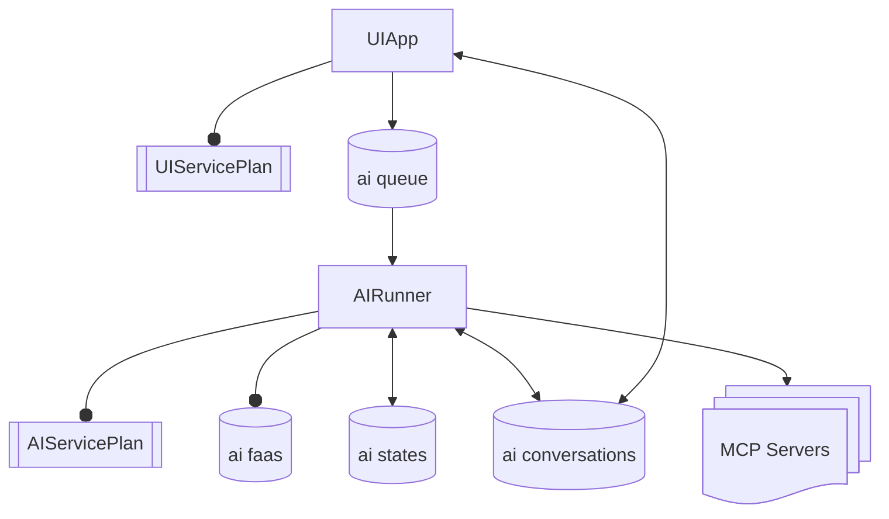

# Terraform of Pachinko demonstrator

```mermaid
flowchart TB
    UIServicePlan[[UIServicePlan]]
    UIApp
    ConversationContainer[(ai conversations)]
    StatesContainer[(ai states)]
    QueueContainer[(ai queue)]
    FaaSContainer[(ai faas)]
    AIServicePlan[[AIServicePlan]]
    AIRunner
    MCP@{shape: docs, label: "MCP Servers"}
    UIApp --o UIServicePlan
    UIApp --> QueueContainer
    AIRunner --o AIServicePlan
    AIRunner --o FaaSContainer
    QueueContainer --> AIRunner
    UIApp <--> ConversationContainer
    AIRunner <--> ConversationContainer
    AIRunner <--> StatesContainer
    AIRunner --> MCP
```